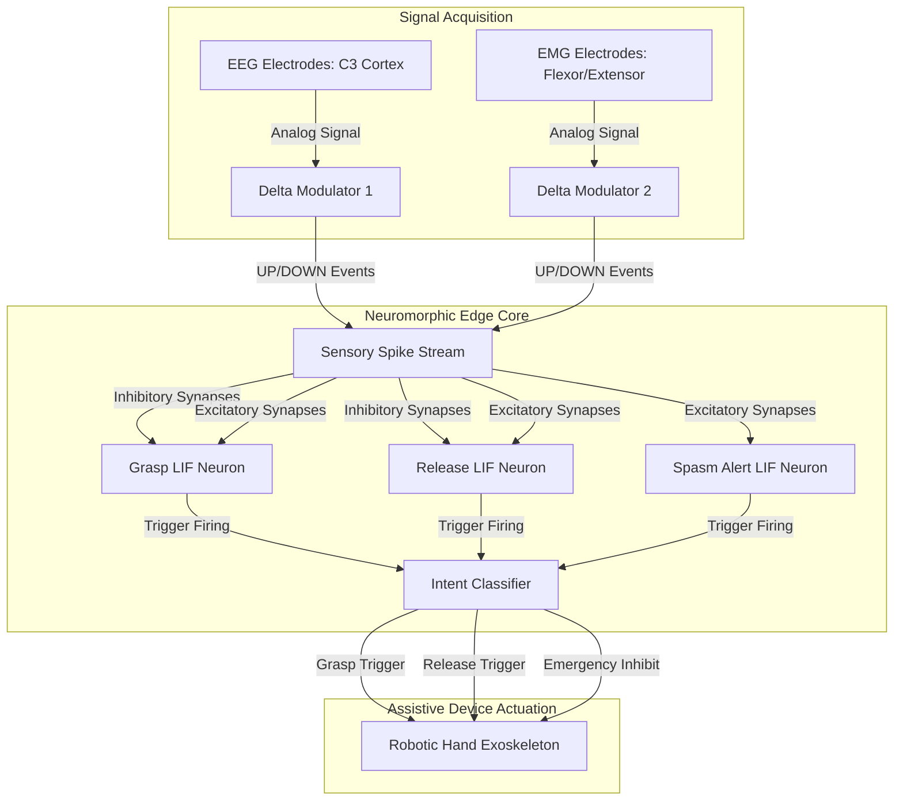

# Stroke Assistive Neuromorphic Interface (SANI)
### Real-Time EEG/EMG Motor Intent Detection & Exoskeleton Trigger

A neuromorphic engineering prototype designed to process biological brain (EEG) and muscle (EMG) signals in real-time, detecting motor intent in stroke recovery patients with minimal latency and power consumption.

---

## 🧠 System Architecture

---

## 🛠️ Neuromorphic Engineering Principles

This prototype demonstrates three core principles of Neuromorphic Edge Intelligence:

### 1. Asynchronous Delta Modulation (Analog-to-Spike Converter)
Traditional systems digitize biological signals using high-speed Analog-to-Digital Converters (ADCs) at fixed sampling rates, transmitting continuous data regardless of activity. 
SANI utilizes an **asynchronous delta modulator** which outputs a 1-bit event (UP spike or DOWN spike) only when the signal deviates from a baseline reference voltage by more than a threshold ($\theta$):
$$x[t] - x_{ref} \ge \theta \implies \text{UP Spike}, \quad x_{ref} \leftarrow x_{ref} + \theta$$
$$x[t] - x_{ref} \le -\theta \implies \text{DOWN Spike}, \quad x_{ref} \leftarrow x_{ref} - \theta$$
* **Power benefit:** When the patient is at rest, no spikes are generated. The system enters a deep idle sleep state, drawing only static leakage power (~10 µW).
* **Sparsity:** Up to 99% data reduction during idle periods.

### 2. Leaky Integrate-and-Fire (LIF) Spiking Neural Network
Incoming spike events propagate through synapses with configurable weights ($W$). The membrane potential ($V_m$) of detector neurons integrates these inputs over time, leaking charge continuously to represent temporal decay ($\tau$):
$$V_m[t] = V_m[t-1] \cdot e^{-dt/\tau} + \sum w_i s_i[t]$$
* **Physiological Gating Circuit:**
  * **EEG (Mu/Beta rhythm):** High amplitude oscillations during rest generate continuous spikes that actively **inhibit** the Grasp and Release LIF neurons ($w = -0.6$).
  * **Motor Imagery:** When the patient attempts movement, cortical desynchronization suppresses Mu oscillations, lifting the inhibition.
  * **EMG Activation:** Volitional forearm muscle contraction generates rapid spike trains, providing strong **excitation** ($w = +1.2$) to drive the membrane potential to threshold.
  * **Intent Detection:** Once $V_m \ge V_{thresh}$, the neuron fires an output action potential, resetting $V_m \rightarrow 0$.

### 3. Closed-Loop Biological Latency
Traditional brain-computer interfaces (BCIs) calculate Fast Fourier Transforms (FFT) over sliding windows (typically 120ms to 250ms) to detect Mu suppression. This introduces severe lag.
SANI processes spikes **asynchronously**. The decision fires the instant the membrane threshold is crossed.
* **Latency:** < 10 ms (Neuromorphic) vs. > 140 ms (Traditional DSP).
* **Neuroplasticity:** Short delay ($< 25$ ms) between voluntary brain motor commands and physical exoskeleton actuation reinforces biological synaptic pathways, accelerating stroke recovery.

---

## 💻 Running the Prototype

1. Clone or download the folder containing:
   * [index.html]
   * [styles.css]
   * [app.js]
2. Open `index.html` in any web browser (Chrome, Firefox, Edge, Safari). No installation or local server required.
Prototype link:-https://neuro-nex-hackathon-sani.vercel.app/
---

## ⚙️ Interactive Controls Guide

* **Patient Attempt Triggers:** Simulate voluntary motor effort. Observe Mu-rhythm suppression in the EEG line, burst activity in the EMG line, and resulting spike cascades.
* **Stroke Recovery Profiles:**
  * *Healthy Subject:* Low noise, easy SNN triggers.
  * *Mild Motor Hemiparesis:* Moderate signal attenuation, representing standard stroke hemiparesis.
  * *Severe Flaccid Paralysis:* Faint signal, requiring high synaptic weight gain and low thresholds.
  * *Spasticity:* Sudden high muscle bursts, demonstrating the Spasm alert filter override.
* **Hardware Tuning Sliders:** Real-time optimization of sensory threshold ($\theta$), LIF leak rate ($\tau$), membrane threshold ($V_{th}$), and synaptic weights.
